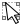
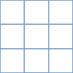
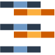
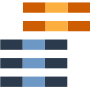

..  Virtual Raster Builder documentation master file, created by
    sphinx-quickstart on Fri Jan 19 05:59:30 2018.
    You can adapt this file completely to your liking, but it should at least
    contain the root `toctree` directive.

.. Substitutions (for p in os.listdir(r'D:\Repositories\QGIS_Plugins\virtual-raster-builder\doc\source\img'): print('.. |{}| image:: img/{}'.format(p,p)))

.. |mActionImportVirtualRaster.png| image:: img/mActionImportVirtualRaster.png
                                :height: 1.2em
                                :width: 1.2em

About
-----

The Virtual Raster Builder is a QGIS Plugin to define GDAL Virtual Raster (VRT) files by drag and drop.
It helps to create a new raster image by stacking, mosaiking, spatial- oder band-subsetting.

Usage
-----

.. image:: img/workflow.png

1. Add source files
...................

Add potential raster sources to the list of source files:

===============================  ================================================
Button                           Action
===============================  ================================================
|mActionAddRasterLayer.png|      Add source raster
|mActionRemoveRasterLayer.png|   Remove source raster
|mActionImportFromRegistry.png|  Load source raster files that are known to QGIS
|mActionExpandTree.png|          expand source file tree node(s)
|mActionCollapseTree.png|        collapse source file tree node(s)
===============================  ================================================

2. Specify VRT structure
........................

Specify the VRT structure by drag and drop of source bands

================================  ===========================================
Button                            Action
================================  ===========================================
|mActionAddVirtualRaster.png|     Add virtual band
|mActionRemoveVirtualRaster.png|  Remove virtual band
|mActionImportVirtualRaster.png|  Import virtual bands from existing VRT file
|mActionExpandTree.png|           Expand VRT tree node(s)
|mActionCollapseTree.png|         Collapse VRT tree node(s)
--------------------------------  -------------------------------------------
|mOptionStackFiles.png|           Drop bands as band stack (default)
|mOptionMosaikFiles.png|          Drop bands as band mosaik
================================  ===========================================

* search for source bands using wildcard (`band`or regular expression (checkbox `.*`).
* activate |mOptionStackFiles.png| to drag & drop each of multiple raster bands into a new virtual band (band stack).
  If required, new virtual band are created automatically.
* activate |mOptionMosaikFiles.png| to drag & drop multiple raster bands into the same virtual band (band mosaik)
* rename virtual bands with double-click or F2.

3. Specify output settings
..........................

* set resampling of source rasters into the output coordinate reference system
* specify the no data value for pixels without any source image data
* set the output raster grid
    * set the coordinate reference system
    * set the spatial extent in coordinate units or pixel
    * set the pixel sizes / ground sampling distance in coordinate units

* set output path & file format
    * GDAL Virtual Image (`*.vrt`, default)
    * GeoTIFF (`*.tif`)
    * ENVI Raster Image (`*.bsq` band sequential (default), `*.bil` band interleave by line, `*.bip` band interleave by pixel)

4. Save Virtual Raster
......................

Save the new file as `GDAL Virtual Raster (VRT) <https://gdal.org/drivers/raster/vrt.html>`_.

In case of other output formats, e.g. GeoTIFF, the VRT is created in a temporary location first and gets translated into the binary file
afterwards using `gdal.Translate <http://gdal.org/python/osgeo.gdal-module.html#TranslateOptions>`_.

Links
-----

======================  ===========================================
Source Code             https://bitbucket.org/jakimowb/virtual-raster-builder
Online Documentation    https://virtual-raster-builder.readthedocs.io/en/latest/
Issue Tracker           https://bitbucket.org/jakimowb/virtual-raster-builder/issues
QGIS Plugin Repository  https://plugins.qgis.org/plugins/vrtbuilderplugin/
======================  ===========================================

Licence
-------

The Virtual Raster Builder is licenced under the `GPL-3 Licence <https://www.gnu.org/licenses/gpl-3.0.html>`_.

